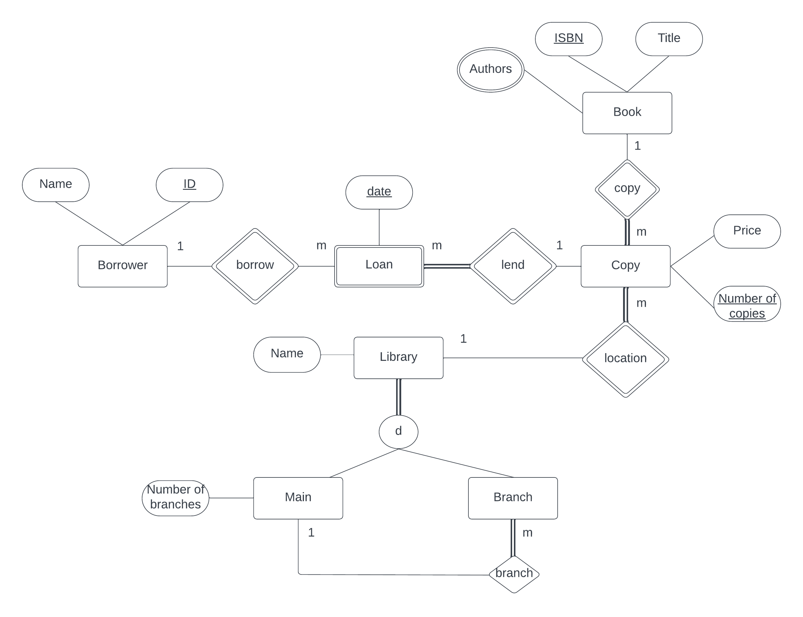

# `Program 1`

A library service wants to create a database to store details of its libraries, books and borrowers. Details include the following:
A book has a unique ISBN number, a title and one or more authors. The library service may own several copies of a given book, each of which is located in one of the service's libraries. A given library contains many books, and in order to distinguish different copies of the same book a library assigns a different copy number to each of its copies of a given book, the price that was paid for each copy is also recorded. Every library may have zero or more branch libraries and every branch library is a branch of exactly one main library. A borrower has a name and  a unique ID code. A borrower can have many books on loan, but each copy of a book can only be on loan to one borrower. A borrower could borrow the same book on several occassions, but it is assumed that each such loan will take place on a different date.

Draw ER/EER diagram for the above requirement.

## `Entity and its attributes`

* Book
  * ISBN number (Primary Key)
  * Title
  * Authors (Multi-valued)

* Borrower
  * ID (primary Key)
  * Name

* Loan
  * Date (Primary Key)

* Copy
  * Number of copies (Primary Key)
  * Price

* Library
  * Name

* Main library
  * Number of branches

* Branch library

## `Relationships`

* Book-Copy (One-to-Many)
* Copy-Loan (One-to-Many)
* Loan-Borrower (Many-to_one)
* Copy-Library (Many-to-One)
* Main-Branch (One-to-Many)