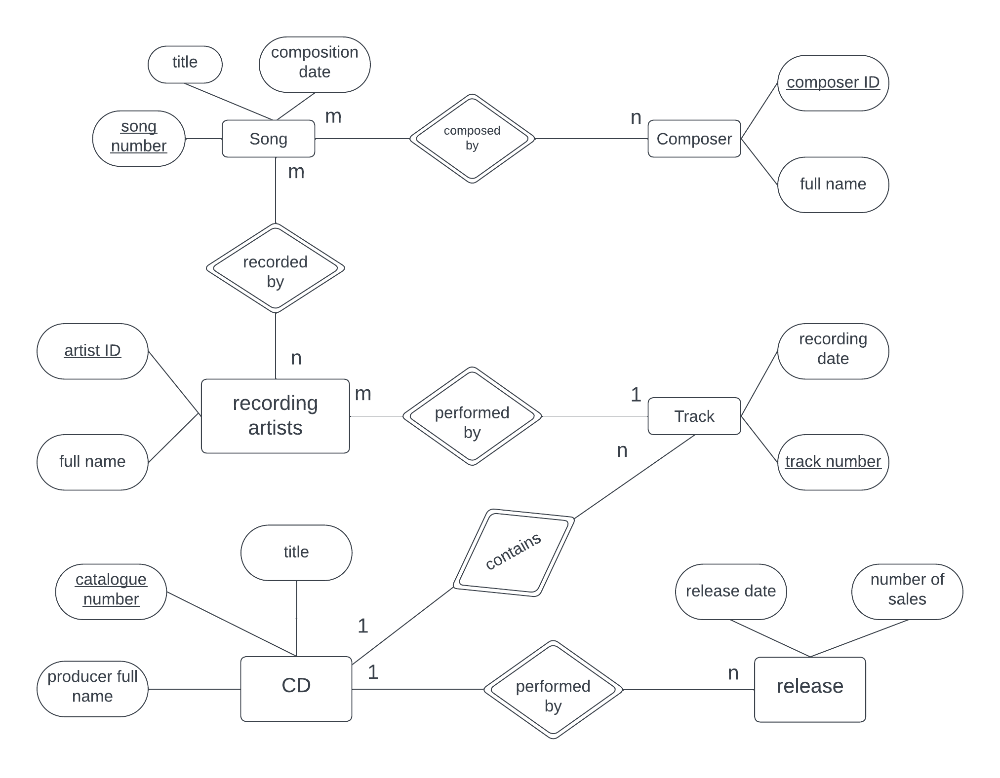

# `Program 2`

A record company wishes to use a computer database to help with its operations regarding its performers, recordings and song catalogue. A requirements analysis has elicited the following information: Songs have a unique song number, a non-unique title and a composition date. A song can be written by a number of composers; the composer's full name is required. Songs are recorded by recording artists (bands or solo performers). A song is recorded as a track of a CD. A CD has many songs on it, called tracks. CDs have a unique record catalogue number, a title and must have a producer (the full name of the producer is required). Each track must have the recording date and the track number of the CD. A song can appear on many (or no) CDs, and be recorded by many different recording artists. The same recording artist might re-record the same song on different CDs. A CD must have only I recording artist appearing on it. CDs can be released a number of times, and each time the release date and associated number of sales is required. 

Use this information to design an appropriate ER/EER model.

## `Entity and its Attributes`

* Song
    * Song Number (Primary Key)
    * Title
    * Composition Date

* Composer
  * Composer ID (Primary Key)
  * Full Name

* Recording Artist
    * Artist ID (Primary Key)
    * Name

* CD
    * Catalogue Number (Primary Key)
    * Title
    * Producer full name

* Track
    * Track Number (Primary Key)
    * Recording Date

* Release
    * Release date
    * Number of sales

## `Relationships`

* Song - Composer (Many-to-Many)
* Song - Recording Artist (Many-to-Many)
* Recording Artist - Track (Many-to-One)
* CD - Track (One-to-Many)
* CD - Release (One-to-Many)