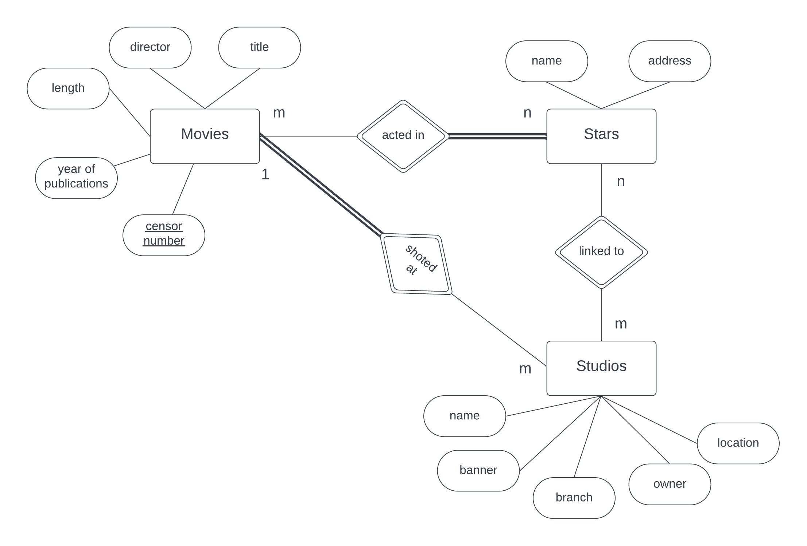

# `Program 3`

Information about films holds information about movies, stars and studios. Movies have a title, year of production, director, censor_no, & length. Stars have a name & address. Studios have a studio name, branch, location, owner & a banner. Movies are shot in studios that own them. A movie is shot in just one studio. Stars are linked to one or more studios but can act in any film that may or may not be owned through the studio. Arrive at an ER diagram. Draw the ER diagram using ERD tool. Clearly denotes attributes, keys, the cardinality ratios and particular constraints.




## `Entity and its Attributes`

* Movie
    * Title (Primary Key)
    * Year of Production
    * Director
    * Censor Number
    * Length

* Star
    * Name (Primary Key)
    * Address

* Studio
    * Studio Name (Primary Key)
    * Branch
    * Location
    * Owner
    * Banner


## `Relationships`

* Movie-Studio: One-to-One 
* Star-Studio: Many-to-Many
* Star-Movie: Many-to-Many 


## `SQL Queries`

A. Write SQL injection query to create the tables & insert few tuples to all the relations.
```sql
CREATE TABLE MOVIE (TITLE VARCHAR(20), YEAR_OF_PRODUCTION YEAR(4), DIRECTOR VARCHAR(20), CENSOR_NO VARCHAR(20) PRIMARY KEY, LENGTH INT(3));

INSERT INTO MOVIE VALUES('BAHUBALI', 2017, 'S S RAJAMOULI', 'CNO001', 126);
INSERT INTO MOVIE VALUES('BAHUBALI 2', 2019, 'S S RAJAMOULI', 'CNO002', 138);
INSERT INTO MOVIE VALUES('KGF', 2019, 'PRASHANTH NEEL', 'CNO003', 142);
INSERT INTO MOVIE VALUES('KGF 2', 2021, 'PRASHANTH NEEL', 'CNO004', 148);
INSERT INTO MOVIE VALUES('KANTAARA', 2022, 'RISHAB SHETTY', 'CNO005', 136);

SELECT * FROM MOVIE;


CREATE TABLE STUDIOS (NAME VARCHAR(20), BRANCH VARCHAR(20), LOCATION VARCHAR(20), BANNER VARCHAR(20), OWNER VARCHAR(20), ACTED_IN VARCHAR(20) REFERENCES MOVIE(CENSOR_NO));

INSERT INTO STUDIOS VALUES('ST1', 'R T NAGAR', 'BENGALURU', 'KANNADA', 'PRUTHVI', 'CNO003');
INSERT INTO STUDIOS VALUES('ST2', 'SIKINDRABAD', 'HYDERABAD', 'TELUGU', 'DARSHAN', 'CNO002');
INSERT INTO STUDIOS VALUES('ST3', 'RAJINI NAGAR', 'HYDERABAD', 'TELUGU', 'MOULI', 'CNO001');
INSERT INTO STUDIOS VALUES('ST4', 'HEBBAL', 'BENGALURU', 'KANNADA', 'SHIVARAJ', 'CNO005');
INSERT INTO STUDIOS VALUES('ST5', 'DHABA', 'MUMBAI', 'HINDI', 'HRITHIK', 'CNO004');

SELECT * FROM STUDIOS;


CREATE TABLE STARS (NAME VARCHAR(20), ADDRESS VARCHAR(20), MOVIE_ACTED VARCHAR(20) REFERENCES MOVIE(CENSOR_NO));

INSERT INTO STARS VALUES('JOHN', 'BENGALURU', 'CNO003');
INSERT INTO STARS VALUES('PRABHAS', 'HYDERABAD', 'CNO001');
INSERT INTO STARS VALUES('KRITI SANON', 'MUMBAI', 'CNO004');
INSERT INTO STARS VALUES('HRITHIK ROSHAN', 'DELHI', 'CNO002');
INSERT INTO STARS VALUES('RISHAB SHETTY', 'BENGALURU', 'CNO005');
INSERT INTO STARS VALUES('YASH', 'BENGALURU', 'CNO003');
INSERT INTO STARS VALUES('ANUSHKA', 'HYDERABAD', 'CNO002');

SELECT * FROM STARS;
```

B. List all the studios of the movie "KGF"
```sql
SELECT m.TITLE, st.NAME
FROM MOVIE m
JOIN STUDIOS st ON m.CENSOR_NO=st.ACTED_IN 
WHERE m.TITLE="KGF";
```

| TITLE | NAME |
|---|---|
| KGF | ST1 |


C. List all the actors acted in the movie "Bahubali"
```sql
SELECT m.TITLE, ss.NAME 
FROM MOVIE m
JOIN STARS ss ON ss.MOVIE_ACTED=m.CENSOR_NO 
WHERE m.TITLE="BAHUBALI";
```

| TITLE	| NAME |
|---|---|
| BAHUBALI | PRABHAS |


D. Find all movies (& directors) not directed by "S S RAJAMOULI"
```sql
SELECT m.TITLE, m.DIRECTOR
FROM MOVIE m
WHERE NOT m.DIRECTOR="S S RAJAMOULI";
```

|TITLE | DIRECTOR|
|---|---|
| KGF | PRASHANTH NEEL |
| KGF 2	| PRASHANTH NEEL |
| KANTAARA | RISHAB SHETTY |


E. Find all movies released in the years between 2020 & 2024
```sql
SELECT TITLE, YEAR_OF_PRODUCTION
FROM MOVIE 
WHERE YEAR_OF_PRODUCTION 
BETWEEN 2020 AND 2024;
```

| TITLE | YEAR_OF_PRODUCTION |
|---|---|
| KGF 2 | 2021 |
| KANTAARA | 2022 |


F. Find first 5 movies sorted automatically
```sql
SELECT TITLE 
FROM MOVIE 
ORDER BY TITLE 
LIMIT 5;
```

| TITLE |
|---|
| BAHUBALI |
| BAHUBALI 2 |
| KANTAARA |
| KGF |
| KGF 2 |


G. List the last 4 movies released (ordered from most recent to least)
```sql
SELECT TITLE, YEAR_OF_PRODUCTION 
FROM MOVIE 
ORDER BY YEAR_OF_PRODUCTION DESC 
LIMIT 4;
```

| TITLE | YEAR_OF_PRODUCTION |
|---|---|
| KANTAARA | 2022 |
| KGF 2	| 2021 |
| BAHUBALI 2 | 2019 |
| KGF | 2019 |


H. Select movies shot in studios "ST1"
```sql
SELECT TITLE, NAME 
FROM MOVIE 
JOIN STUDIOS ON MOVIE.CENSOR_NO=STUDIOS.ACTED_IN 
WHERE NAME="ST1";
```

| TITLE | NAME |
|---|---|
| KGF | ST1 |


I. Select movies shot in "ST1" & acted by actor "JOHN"
```sql
SELECT st.NAME, ss.NAME, m.TITLE
FROM MOVIE m
JOIN STARS ss ON m.CENSOR_NO=ss.MOVIE_ACTED
JOIN STUDIOS st ON st.ACTED_IN=m.CENSOR_NO
WHERE st.NAME="ST1" AND ss.NAME="JOHN";
```

| NAME | NAME | TITLE |
|---|---|---|
| ST1 | JOHN | KGF |